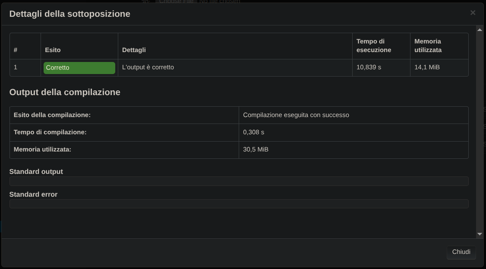

# Movhex — Prova Finale di Algoritmi e Strutture Dati (2024-2025)

Implementazione in C del progetto finale del corso di **Algoritmi e Strutture Dati** — Politecnico di Milano, a.a. 2024-2025.



## 📋 Il problema

Movhex è una compagnia di autotrasporti con una flotta dispersa su un'ampia area geografica. Il programma modella la superficie percorribile come una **mappa esagonale** (righe × colonne), dove ogni esagono:

- ha un **costo di uscita via terra** (0 = non abbandonabile, 1–100 altrimenti);
- può essere collegato ad altri esagoni tramite **rotte aeree** monodirezionali (al più 5 per esagono), ciascuna con un proprio costo.

L'obiettivo è rispondere in modo efficiente a query sul **costo minimo di spostamento** tra due esagoni, gestendo al contempo modifiche dinamiche alla mappa (variazioni di costo, apertura/chiusura di rotte aeree).

Il programma legge comandi da standard input e risponde su standard output:

| Comando | Descrizione |
|---|---|
| `init <colonne> <righe>` | Inizializza (o reinizializza) la mappa |
| `change_cost <x> <y> <v> <raggio>` | Modifica il costo degli esagoni entro un dato raggio da `(x, y)` |
| `toggle_air_route <x1> <y1> <x2> <y2>` | Aggiunge o rimuove una rotta aerea tra due esagoni |
| `travel_cost <xp> <yp> <xd> <yd>` | Calcola il costo minimo per raggiungere la destinazione dalla partenza |

La specifica completa, con la formula di aggiornamento dei costi e un esempio commentato passo per passo, è disponibile in [`specifica.pdf`](specifica.pdf).

## ⚙️ Come funziona

Il programma è scritto in **C puro** (nessuna libreria esterna oltre alla standard library) e implementa:

- una **griglia esagonale** (`offset coordinates`) con adiacenze diverse a seconda della parità della riga;
- **Dijkstra** con **min-heap** per il calcolo dei percorsi minimi (`dijkstra`, `MinHeap`);
- una **cache dei percorsi già calcolati** (hash table con `hash_coordinate`), pensata per sfruttare la natura del carico di lavoro reale: pochi `change_cost`/`toggle_air_route`, molti `travel_cost` spesso concentrati sulle stesse zone della mappa.

## 🛠️ Compilazione ed esecuzione

```bash
gcc -O2 -Wall -o movhex 30.c -lm
./movhex
```

Il programma legge i comandi da standard input finché non riceve EOF; puoi anche rediriggere un file di test:

```bash
./movhex < test/input.txt > output.txt
```

### Esempio

```
init 100 100
change_cost 10 20 -10 5
change_cost 30 95 10 1
travel_cost 0 0 20 0
```
```
OK
OK
OK
20
```

## 📈 Valutazione

Uno screenshot del risultato del test automatico è disponibile in `risultato_finale.png`. La valutazione è 30.

## 📄 Licenza

Distribuito con licenza [MIT](LICENSE). Il testo della specifica (`specifica.pdf`) è proprietà del Politecnico di Milano ed è incluso a solo scopo illustrativo.
